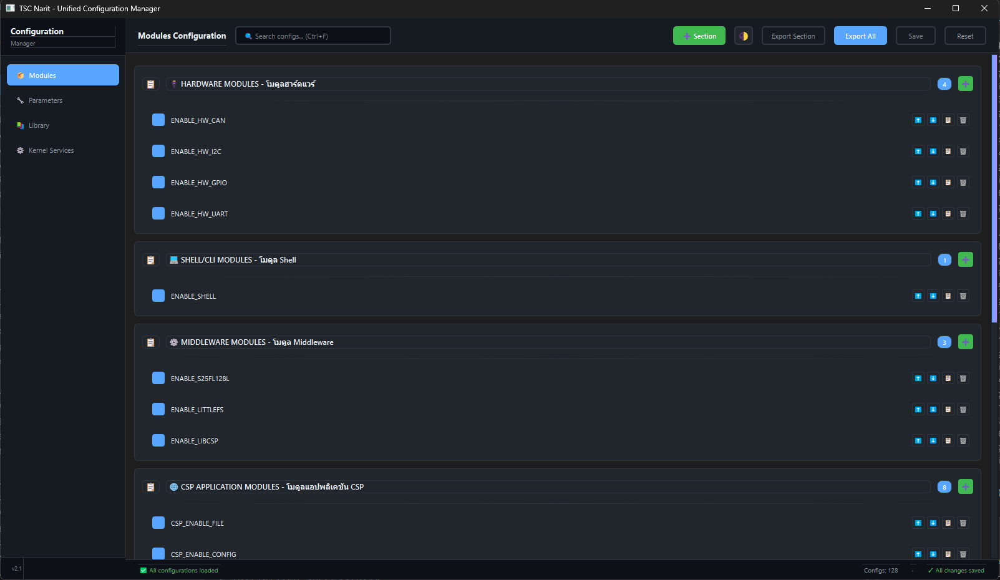
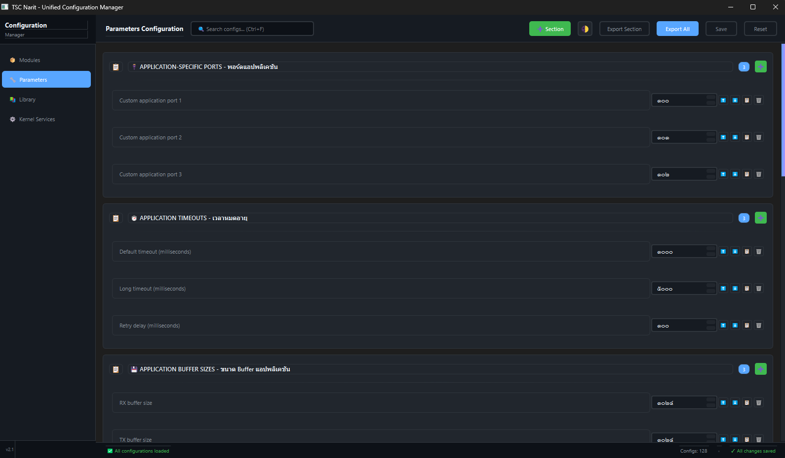

# STM32ConfigManager

A comprehensive configuration management tool for embedded systems with both CLI and GUI interfaces. STM32ConfigManager simplifies the management of hardware modules, application parameters, library configurations, and kernel service definitions for STM32-based embedded projects.

## 🚀 Interface Screenshots

### Main Interface



### Example Usage



## ✨ Key Features

### Core Features
- **Multi-Interface Support**: Both CLI and GUI interfaces
- **Configuration Management**: Handle 4 types of configurations (modules, params, library, ksdef)
- **Auto-Detection**: Automatically locate configuration files
- **Validation**: Comprehensive configuration validation with real-time feedback
- **Export**: Export configurations to embedded projects
- **Cross-Platform**: Windows and Linux support
- **Dynamic Config Management**: Add, delete, duplicate, and reorder configs through GUI
- **Undo/Redo**: Full undo/redo support for configuration changes
- **Config Profiles**: Save and load configuration presets (coming soon)

### CLI Features
- Command-line interface for automation and scripting
- List, get, set, enable, disable configurations
- Export to projects with automatic linker and build file updates
- Batch operations support
- Integration with CI/CD pipelines

### GUI Features (v2.1)
- **Modern Interface**: Dark/Light theme with intuitive sidebar navigation
- **Real-time Validation**: Instant feedback on invalid values with visual indicators
- **Undo/Redo System**: Full undo/redo support with state management (Ctrl+Z/Ctrl+Y)
- **Dynamic Config Management**:
  - ➕ Add new configs to any section
  - 🗑️ Delete configs with confirmation
  - 📋 Duplicate configs with custom names
  - ⬆️⬇️ Reorder configs within sections
  - ➕ Add new sections to config files
- **Keyboard Shortcuts**: 
  - Ctrl+S (Save), Ctrl+R (Reset), Ctrl+Z (Undo), Ctrl+Y (Redo)
  - Ctrl+E (Export All), Ctrl+F (Search), Ctrl+T (Theme Toggle)
- **Advanced Search**: Filter configs by name, description, or section
- **Export Options**: Export all configs or individual sections
- **Dirty-State Tracking**: Visual feedback for unsaved changes
- **Compact Design**: Optimized spacing and font sizes for better information density
- **No Logic Duplication**: Uses core modules for all business logic

## 📋 Table of Contents

- [Installation](#installation)
- [Quick Start](#quick-start)
- [Usage](#usage)
  - [CLI Usage](#cli-usage)
  - [GUI Usage](#gui-usage)
- [Configuration Types](#configuration-types)
- [Architecture](#architecture)
- [Documentation](#documentation)
- [Examples](#examples)
- [Contributing](#contributing)

## 🔧 Installation

### Prerequisites
- Python 3.8 or higher
- pip package manager

### Install Dependencies

```bash
pip install -r requirements.txt
```

Or install individual packages:

```bash
pip install typer>=0.7.0  # For CLI
pip install PySide6       # For GUI (optional)
```

### Setup

STM32ConfigManager is ready to use as part of the unified_config_manager package. No additional installation needed.

## 🎯 Quick Start

### CLI Quick Start

```bash
# List all configurations
python -m unified_config_manager.cli.main list modules

# Get a specific value
python -m unified_config_manager.cli.main get ENABLE_HW_CAN

# Set a value
python -m unified_config_manager.cli.main set ENABLE_HW_CAN 1

# Enable a module
python -m unified_config_manager.cli.main enable ENABLE_SHELL

# Export all configurations
python -m unified_config_manager.cli.main export all /path/to/project
```

### GUI Quick Start

```bash
# Launch the GUI
python unified_config_manager/gui/pyside6_main.py
```

Or create a launcher script:

**Windows (start_gui.bat):**
```batch
@echo off
python unified_config_manager/gui/pyside6_main.py
```

**Linux/macOS (start_gui):**
```bash
#!/bin/bash
python unified_config_manager/gui/pyside6_main.py
chmod +x start_gui
```

## 📖 Usage

### CLI Usage

#### Create Launcher Script

**Linux/macOS:**
```bash
echo '#!/bin/bash' > scm
echo 'python -m unified_config_manager.cli.main "$@"' >> scm
chmod +x scm
sudo mv scm /usr/local/bin/
```

**Windows:**
```batch
@echo off
python -m unified_config_manager.cli.main %*
```
Save as `scm.bat` and add to PATH.

#### Available Commands

**List Configurations**
```bash
scm list modules      # List all modules
scm list params -v    # List params with descriptions
scm list library      # List library configurations
scm list ksdef       # List kernel service definitions
```

**Get Configuration Value**
```bash
scm get ENABLE_HW_CAN              # Auto-detect config type
scm get CSP_DEBUG --type library   # Specify config type
```

**Set Configuration Value**
```bash
scm set ENABLE_HW_CAN 1            # Set value
scm set CSP_BUFFER_SIZE 2048       # Set number value
scm enable ENABLE_SHELL            # Enable (set to 1)
scm disable ENABLE_HW_UART         # Disable (set to 0)
```

**Validate Configurations**
```bash
scm validate  # Check all configuration files
```

**Export Configurations**
```bash
scm export modules /path/to/project        # Export modules
scm export all /path/to/project            # Export all
scm export all /path/to/project --no-update-linker  # Skip linker update
```

#### CLI Examples

**Enable Hardware Module:**
```bash
scm list modules -v
scm enable ENABLE_HW_CAN
scm get ENABLE_HW_CAN
```

**Adjust Buffer Size:**
```bash
scm get CSP_BUFFER_SIZE
scm set CSP_BUFFER_SIZE 4096
scm get CSP_BUFFER_SIZE
```

**Batch Configuration:**
```bash
#!/bin/bash
for module in ENABLE_HW_CAN ENABLE_HW_UART ENABLE_HW_I2C; do
    scm enable "$module"
done
```

### GUI Usage

#### Launch GUI

```bash
python unified_config_manager.py
```

Or use the launcher script created earlier.

#### GUI Features (v2.1)

**Modern Sidebar Navigation:**
- 📦 Modules - Hardware and software module configurations
- 🔧 Parameters - Application-specific parameters
- 📚 Library - Library and protocol configurations
- ⚙️ Kernel Services - Kernel service definitions

**Action Buttons:**
- **➕ Section**: Add new section to current config file
- **🌓 Theme Toggle**: Switch between dark and light themes (Ctrl+T)
- **Export Section**: Export only the current section
- **Export All**: Export all configurations to project (Ctrl+E)
- **Save**: Save changes in current section (Ctrl+S)
- **Reset**: Revert changes in current section (Ctrl+R)

**Config Item Actions:**
Each config item has action buttons:
- **⬆️ Move Up**: Move config up in the list
- **⬇️ Move Down**: Move config down in the list
- **📋 Duplicate**: Create a copy with a new name
- **🗑️ Delete**: Remove config (with confirmation)

**Section Actions:**
- **➕ Add Config**: Add new configuration to the section

**Real-time Validation:**
- Invalid values show red border and error message
- Validation rules for common configs (stack sizes, priorities, etc.)
- Visual feedback prevents invalid configurations

**Undo/Redo:**
- Ctrl+Z: Undo last change
- Ctrl+Y: Redo last undone change
- Status bar shows undo/redo actions
- State management preserves all changes

**Search & Filter:**
- Ctrl+F: Focus search box
- Real-time filtering by config name, description, or section
- Instant results as you type

**Keyboard Shortcuts:**
- Ctrl+S: Save current section
- Ctrl+R: Reset current section (with confirmation)
- Ctrl+Z: Undo last change
- Ctrl+Y: Redo last undone change
- Ctrl+E: Export all configurations
- Ctrl+F: Focus search box
- Ctrl+T: Toggle theme (dark/light)

**Status Bar:**
- Shows total config count
- Displays unsaved changes indicator
- Shows operation status messages
- Real-time feedback on actions

#### GUI Workflow

**Basic Workflow:**
1. **Open Application**: Launch GUI - configurations auto-load
2. **Navigate**: Use sidebar to switch between config types
3. **Make Changes**: Toggle checkboxes, adjust values, edit text
4. **Save Changes**: Click Save or press Ctrl+S
5. **Export**: Click Export All to export to project
6. **Reset**: Click Reset or press Ctrl+R to revert unsaved changes

**Adding New Config:**
1. Navigate to desired section
2. Click **➕** button in section header
3. Fill in config details:
   - Config Name (e.g., `ENABLE_NEW_FEATURE`)
   - Description
   - Type (Toggle/Number/String)
   - Default Value
   - Optional comment
4. Click OK
5. Config is added to file and GUI refreshes

**Reordering Configs:**
1. Find config you want to move
2. Click **⬆️** to move up or **⬇️** to move down
3. Config position changes in both file and GUI
4. Repeat as needed

**Duplicating Config:**
1. Click **📋** button next to config
2. Enter new name for the copy
3. Config is duplicated with same value

**Deleting Config:**
1. Click **🗑️** button next to config
2. Confirm deletion
3. Config is removed from file

**Adding New Section:**
1. Click **➕ Section** button in header
2. Enter section name and optional description
3. New section is added to config file

## 📊 Configuration Types

| Type | File | Description | Count |
|------|------|-------------|-------|
| `modules` | `Configuration/app_modules_config.h` | Hardware module enable/disable | 19 |
| `params` | `Configuration/csp_app_params.h` | Application parameters | 18 |
| `library` | `Configuration/csp_library_config.h` | Library configurations | 81 |
| `ksdef` | `Configuration/ksdef.h` | Kernel service definitions | 37 |

### Modules Configuration
Hardware and software module enable/disable flags:
- Hardware: CAN, UART, I2C, GPIO
- Shell: Command Line Interface
- Middleware: libcsp, LittleFS, Flash driver
- CSP Services: File, Config, Thread, Log, Data Monitor, Route, Register
- Time: GNSS, CTP, PPS
- Automation: Script Manager

### Params Configuration
Application-specific parameters:
- Custom ports
- Timeouts and delays
- Buffer sizes
- Connection settings
- Retry settings
- Node addressing
- Queue sizes
- Feature flags
- Logging configuration

### Library Configuration
libcsp and system library settings:
- Version and platform info
- Debug and logging
- Protocol features (RDP, CRC32, HMAC, XTEA)
- Default server settings
- Route manager
- Time protocol (CTP)
- Thread manager
- Config manager
- Log manager
- File manager
- Data monitor
- Register service
- KISS interface

### KS Def Configuration
Kernel service definitions:
- Error codes
- Boolean types
- Alignment macros
- List structures
- Private defines
- Console configuration
- RTC and PPS
- Logging configuration

## 🏗️ Architecture

### Decoupled Workflow (CI/CD Ready)

STM32ConfigManager operates as a standalone tooling repository and no longer relies on Git submodules for the core firmware. This decoupled architecture avoids circular dependencies and makes CI/CD integration much cleaner.

**Workflow in CI/CD:**
1. Clone the firmware repository (`ThaiSpace-AstraCore-STM32`).
2. Clone `system-configurator` as a tool alongside it (e.g., via `--depth 1`).
3. Run the export script, passing the source firmware path using `--fw-src`.

**Example CI/CD Usage:**
```bash
# 1. Clone the tool
git clone --depth 1 https://gitlab.com/your-group/system-configurator.git

# 2. Assemble the project (merge configurations and framework files into the build target)
python system-configurator/unified_config_manager_cli.py export STM32L496 --fw-src .

# 3. Build the target
cd STM32L496
make -j16 all
```

### Framework Contents

The framework submodule provides:

- **Applications/**: Application modules and services
  - Configuration management (CSP config server/client)
  - CSP services (routing, file, logging, data monitoring, registers)
  - Automation and threading support
  - Time management (GNSS, CTP, PPS)

- **Core/**: Core system files
  - Kernel service headers and sources
  - Shell/CLI components (finsh, msh, shell)
  - Utility services (kservice, list_service)

- **Drivers/**: Hardware drivers
  - S25FL128L flash memory driver

- **Middlewares/**: Third-party libraries
  - **libcsp-1.6**: Cubesat Space Protocol library for satellite communication
  - **littlefs**: Lightweight file system designed for microcontrollers

### Framework Development

For framework development and contribution:
- **Repository**: https://git.narit.or.th/tsc-1/framework/tesr-framework/applications/
- **Documentation**: See individual module README files in framework/applications/
- **Version History**: Check git tags for version history

### Core Modules

```
STM32ConfigManager/
├── unified_config_manager/
│   ├── core/
│   │   ├── config_io.py       # File I/O operations
│   │   ├── config_parser.py   # Parse configuration files (with order preservation)
│   │   ├── config_writer.py   # Write configuration files
│   │   ├── config_modifier.py # Add/Delete/Duplicate/Move configs (NEW)
│   │   ├── export_manager.py  # Export to projects
│   │   ├── linker_updater.py  # Update linker scripts
│   │   ├── models.py          # Data models
│   │   ├── project_updater.py # Update project files
│   │   └── validator.py       # Validation logic
│   ├── cli/
│   │   └── main.py           # CLI interface
│   └── gui/
│       └── pyside6_main.py   # GUI interface (v2.1 with dynamic config management)
├── Configuration/
│   ├── app_modules_config.h   # Module configurations
│   ├── csp_app_params.h       # Application parameters
│   ├── csp_library_config.h   # Library configurations
│   └── ksdef.h                # Kernel service definitions
└── Documentation/
    ├── FEATURES_COMPLETED_SUMMARY.md
    ├── UNDO_REDO_VALIDATION_COMPLETE.md
    ├── DYNAMIC_CONFIG_COMPLETE.md
    └── MOVE_CONFIG_FIX.md
```

### Design Principles

1. **Separation of Concerns**: Core modules handle business logic, CLI/GUI are presentation layers
2. **No Logic Duplication**: Both CLI and GUI use the same core modules
3. **Zero Core Modifications**: Core modules remain unchanged for each interface
4. **Cross-Platform**: Works on Windows and Linux
5. **Extensible**: Easy to add new configuration types

### Data Flow

```
Configuration Files (C headers)
        ↓
   config_parser.py
        ↓
   models.py (Data Models)
        ↓
   CLI/GUI Interface
        ↓
   config_writer.py
        ↓
Configuration Files (C headers)
```

## 💡 Examples

### Example 1: Enable CAN Module

**CLI:**
```bash
scm list modules | grep CAN
scm enable ENABLE_HW_CAN
scm get ENABLE_HW_CAN
scm export modules /path/to/project
```

**GUI:**
1. Open GUI
2. Navigate to Modules tab
3. Find "ENABLE_HW_CAN"
4. Toggle checkbox to enabled
5. Click Save
6. Click Export All

### Example 2: Adjust Buffer Size

**CLI:**
```bash
scm get CSP_BUFFER_SIZE
scm set CSP_BUFFER_SIZE 4096
scm get CSP_BUFFER_SIZE
scm export params /path/to/project
```

**GUI:**
1. Open GUI
2. Navigate to Params tab
3. Find "CSP_BUFFER_SIZE"
4. Click spin box and set to 4096
5. Click Save
6. Click Export All

### Example 3: Dynamic Config Management

**Add New Config (GUI Only):**
1. Open GUI
2. Navigate to desired section
3. Click **➕** button in section header
4. Fill in:
   - Name: `ENABLE_MY_FEATURE`
   - Description: `Enable my custom feature`
   - Type: Toggle
   - Value: 1
5. Click OK
6. Config is added and GUI refreshes

**Reorder Configs (GUI Only):**
1. Find config to move
2. Click **⬆️** or **⬇️** buttons
3. Config moves in both file and GUI
4. Save changes

**Duplicate Config (GUI Only):**
1. Click **📋** next to config
2. Enter new name: `ENABLE_MY_FEATURE_COPY`
3. Config is duplicated

### Example 4: Using Undo/Redo

**GUI:**
1. Make several changes to configs
2. Press Ctrl+Z to undo last change
3. Press Ctrl+Z again to undo more
4. Press Ctrl+Y to redo
5. Status bar shows undo/redo actions

### Example 5: Search and Filter

**GUI:**
1. Press Ctrl+F to focus search
2. Type "CAN" to filter CAN-related configs
3. Only matching configs are shown
4. Clear search to show all configs

### Example 6: Export Complete Configuration

**CLI:**
```bash
scm validate
scm export all /path/to/project
```

**GUI:**
1. Open GUI
2. Make any necessary changes
3. Click Save for each tab with changes
4. Click Export All
5. Select export directory
6. Confirm export

## 📚 Documentation

- [CLI Usage Guide](unified_config_manager/cli/CLI_USAGE_GUIDE.md) - Detailed CLI documentation
- [Features Completed Summary](FEATURES_COMPLETED_SUMMARY.md) - Complete feature list with keyboard shortcuts
- [Undo/Redo & Validation Complete](UNDO_REDO_VALIDATION_COMPLETE.md) - Undo/Redo and validation implementation
- [Dynamic Config Management](DYNAMIC_CONFIG_COMPLETE.md) - Add/Delete/Duplicate/Reorder configs
- [Move Config Fix](MOVE_CONFIG_FIX.md) - Technical details on config reordering
- [Phase A Completion Report](unified_config_manager/PHASEA_COMPLETION_REPORT.md) - GUI Phase A implementation
- [Phase B Completion Report](unified_config_manager/PHASEB_COMPLETION_REPORT.md) - GUI Phase B implementation
- [Phase C Completion Report](unified_config_manager/PHASEC_COMPLETION_REPORT.md) - GUI Phase C implementation

## 🤝 Contributing

Contributions are welcome! Please follow these guidelines:

1. Fork the repository
2. Create a feature branch
3. Make your changes
4. Test thoroughly
5. Submit a pull request

### Development Guidelines

- Use core modules for all business logic
- No logic duplication between CLI and GUI
- Maintain backward compatibility
- Update documentation for new features
- Test on both Windows and Linux

## 📝 Requirements

```
typer>=0.7.0  # CLI framework
PySide6       # GUI framework (optional)
```

## 🔗 Related Links

- [CSP (Cubesat Space Protocol)](https://github.com/libcsp/libcsp)
- [STM32 HAL Driver](https://www.st.com/resource/en/user_manual/dm00105879-description-of-stm32l4-hal-and-lowlayer-drivers-stmicroelectronics.pdf)
- [LittleFS File System](https://github.com/littlefs-project/littlefs)

## 📞 Support

For issues, questions, or contributions:
- Open an issue on GitLab
- Check existing documentation
- Review CLI usage guide
- Review completion reports

---

**STM32ConfigManager** - Streamline your embedded system configuration management.